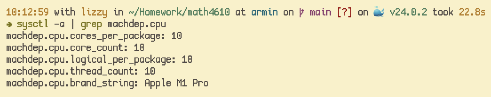

**Question 1** 

I use an Apple Silicon Mac which is based on the ARM architecture - so it's necessary to use 
[Multipass](https://multipass.run/), as native virtualization is _not available to us_.

**Question 2**

One of the downsides of running a virtual machine, as opposed to a hosted virtual instance, is that local
resources are used. On a laptop especially, this increases power draw, draining the battery. Additionally,
the security of mind provided by "faster disaster recovery", as discussed in the article, is not as 
necessary for consumer applications on personal machines as servers. Finally, virtual machines are 
inherently slower in compute due to general overhead.

**Question 3** 

**Question 4** 

In a large application sense, containerizing services into their own virtual machines allows for easier
replication, scaling, and networking. Instead of running several smaller servers, one large server can
host several applications in parallel.

Locally, it can help in development when targeting another operating system. Virtual machines can be
used to verify builds without installing a whole other operating system.

**Question 5**

A native system virtual machine has dedicated hardware to run the hypervisor, while a hosted system 
virtual machine runs a hypervisor as a process in the operating system.

**Question 6**

1. Easier networking between "servers"
2. Efficient resource use

**Question 7**

A Virtual Appliance is built to provide an easy plug-and-play virtual machine image built to run some 
specific software stack.

**Question 8** 

A Virtual Appliance would be desirable to eliminate maintenance and configuration overhead when running an
application. In my own experience, I've used a form of virtual appliances - "Docker Containers", to easily
spin up multiple versions of small services at work.

**Question 9** What are 2 benefits of Virtualization?

See question 6.

**Question 10** 

See question 4.

**Question 11** 

See question 8.

**Question 12**  What are the three main types of virtualization?

1. Full virtualization
2. Para virtualization
3. OS-level virtualization

**Question 13** What you should know about virtualization?

How to create a virtual machine, and maintain it.

**Question 14** What is the weakness of virtualization?

Inherent overhead in all system operations.

**Question 15** What are the six areas of virtualization?

Source: [HiTechNectar](https://www.hitechnectar.com/blogs/virtualization-types)

1. Application - run individual applications in a seperate environment than a host OS
2. Data - abstract exact location and formatting information away from retrieval of data
3. Desktop - hosts a desktop environment virtually on another machine (reminds me of mainframes).
4. Network - physical networking tools are abstracted into software resources
5. Server - division of a server into multiple guest operating systems
6. Storage - abstraction over multiple storage arrays into a single pool

**Question 16** What is the biggest challenge in virtualization?

Resource distribution is a big one; it's difficult to keep track of several resources on a host machine 
and ensure a Virtual Machine accesses them correctly.

**Question 17** What is the risk of using virtualization?

The biggest risk of using virtualization is sandbox escape vulnerabilities. Although mostly research and
proof-of-concept, highly skilled engineers can theoretically craft exploits to escape the sandbox of the
VM and directly mess with the host operating system.

**Question 18**

When (question 17) is trusted; sandboxing. Virtualization should supply no access to resources within the
host operating system.
